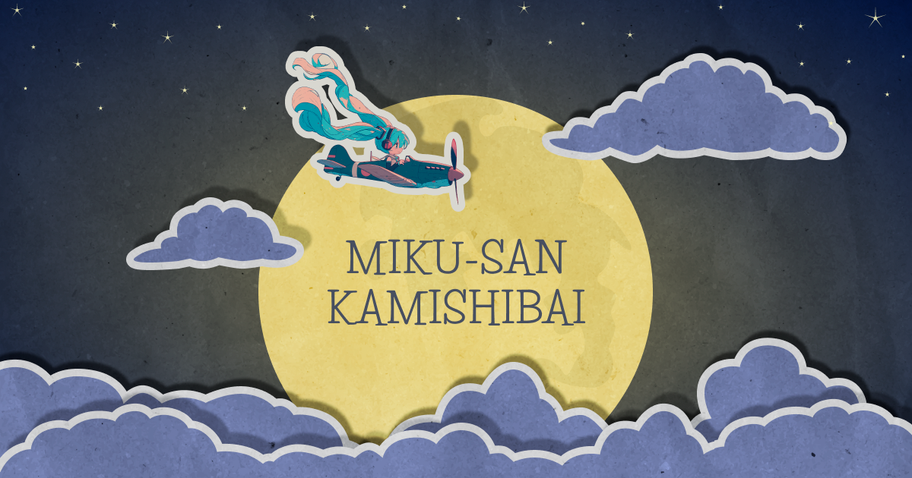

<div align="center">
  
  <hr/>
  <a href="#about">Screenshots</a>
  ·
  <a href="https://mirai24.antosik.me">Demo</a>
  <hr/>
</div>

<details open="open">
<summary>Table of Contents</summary>

- [About](#about)
- [Getting Started](#getting-started)
  - [Prerequisites](#prerequisites)
  - [Installation](#installation)
  - [Build](#build)
- [Technical description](#technical-description)
- [Team](#team)
- [Acknowledgements](#acknowledgements)

</details>

---

## About

<details>
<summary>Screenshots</summary>
<br>

|                            Game                            |
| :--------------------------------------------------------: |
|  |

|                            Start Page                             |                              Main Menu                               |
| :---------------------------------------------------------------: | :------------------------------------------------------------------: |
|  |  |

|                            Help Page                            |                             Credits Page                              |
| :-------------------------------------------------------------: | :-------------------------------------------------------------------: |
|  |  |

</details>

</td></tr></table>

## Getting Started

### Prerequisites

- NodeJS v20

### Installation

1. Clone the repo

```bash
$ git clone https://github.com/Antosik/magicalmirai24
```

2. Install dependencies

```bash
$ npm ci
```

3. Create .env file with the [TextAlive](https://developer.textalive.jp/) application token

```properties
VITE_TEXTALIVE_TOKEN=<YOUR_TOKEN>
```

4. Launch development server

```bash
$ npm run dev
```

### Build

```bash
$ npm run build
```

## Technical description

### Architecture and Project structure

See [ARCHITECTURE.md](./docs/ARCHITECTURE.md)

### TextAlive manageability

App can be fully (or partially) managed by TextAlive App Customizer.

#### Fully managed

In fully-managed mode, everything is controlled by the TextAlive App Customizer.  
[Open this link](https://developer.textalive.jp/app/run/?ta_app_url=https%3A%2F%2Fmirai24.antosik.me&ta_song_url=https%3A%2F%2Fpiapro.jp%2Ft%2FucgN%2F20230110005414) - the app will instantly proceed to game mode and load custom song (宮守文学 - king妃jack躍).
The TextAlive App Customizer is managing play/pause/stop and changeable parameters.

#### Partially managed

In partially-managed mode, user can navigate the menu and control the song to play.  
[Open this link](https://developer.textalive.jp/app/run/?ta_app_url=https%3A%2F%2Fmirai24.antosik.me), remove the song URL (メディア URL) and click reload (更新).
The app will open the main menu, where users can select a song, but other processes are managed by the TextAlive App Customizer, like play/pause/stop and changeable parameters.

### Changeable parameters

- `volume={0-100}` - a number from 0 to 100. Changes the volume. Default - 100.
- `speed={1-100}` - a number from 1 to 100. Changes the symbols speed. Default - 5.
- `autoplay=on` - enables the autoplay mode (Miku-san automatically collects all the lyrics)

Parameters can be changed with:

- TextAlive App Customizer
- Query parameters (for example, https://mirai24.antosik.me/?autoplay=on will enable autoplay mode)

## Team

- Programming - Antosik
- Design - sdobnaya
- Translation - lemma

## Acknowledgements

### TextAlive App API


TextAlive App API は、音楽に合わせてタイミングよく歌詞が動くWebアプリケーション（リリックアプリ）を開発できるJavaScript用のライブラリです。

TextAlive App API について詳しくはWebサイト [TextAlive for Developers](https://developer.textalive.jp/) をご覧ください。

### Background Music

Marble Machine by [Wintergatan](https://www.youtube.com/@wintergatan).  
Approved for non-commercial use.
